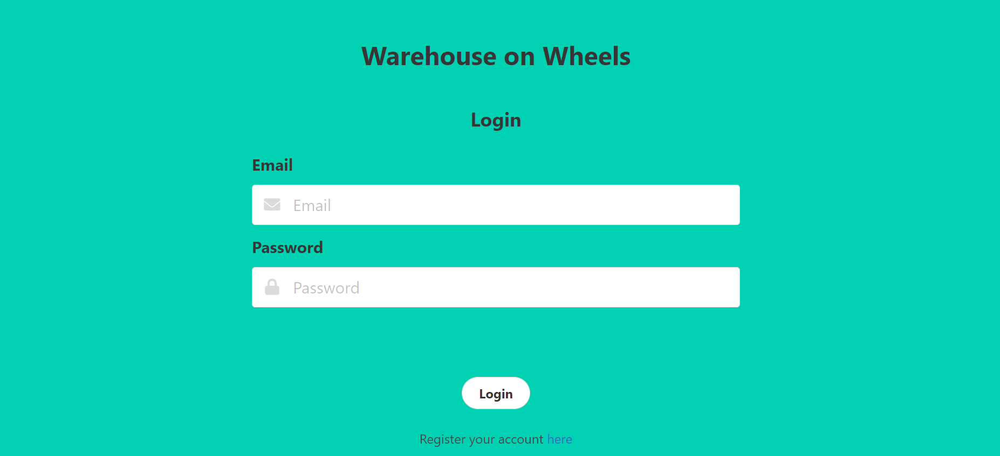
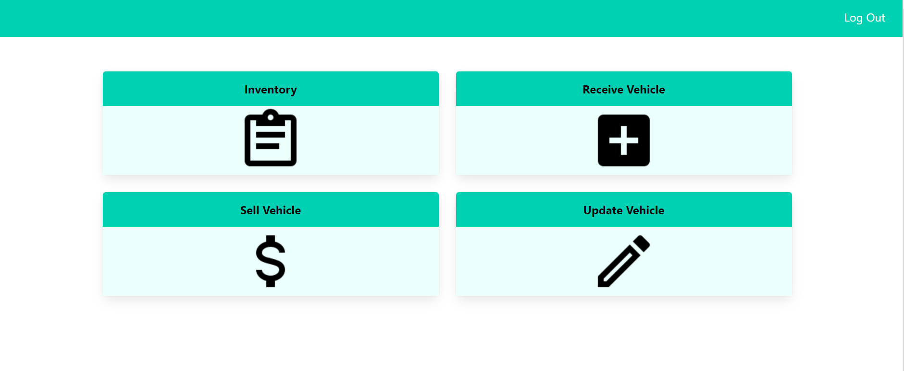
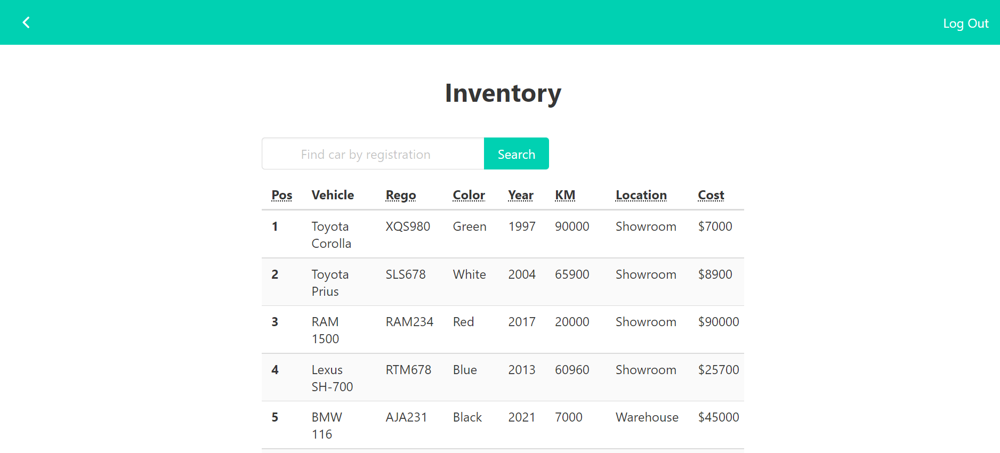
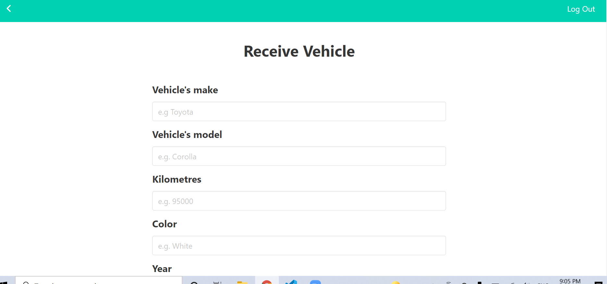
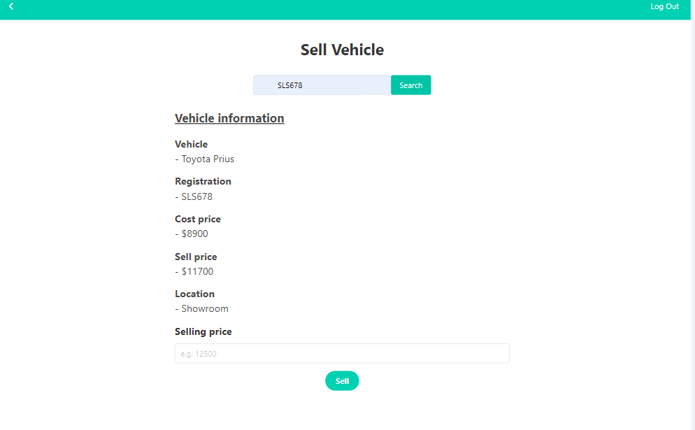
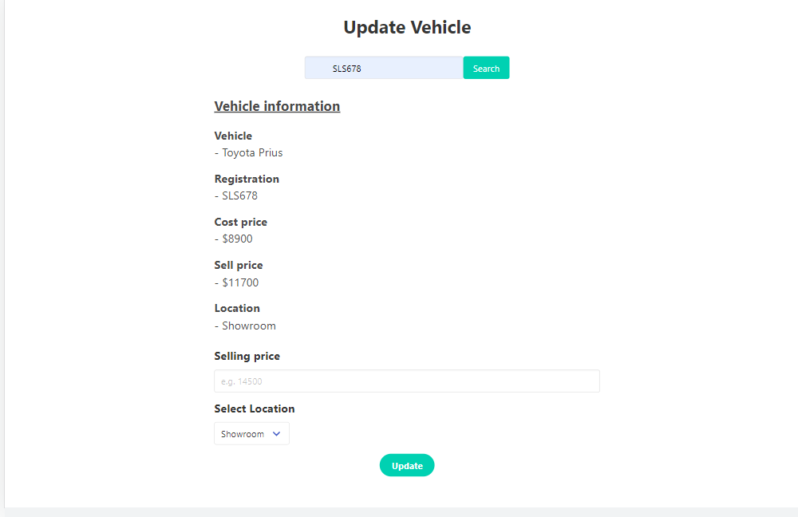

# Warehouse on Wheels

## Description

- Warehouse on Wheels is a Warehouse Management System for Second-hand car dealers. The owner/employee of the car dealership can login using their credentials and manage their inventory anywhere and anytime. A new user/employee can be added by signing up.

- The employee/owner can view all the vehicles in the warehouse,add a new vehicle, update vehicle information and delete it from warehouse database upon sale of the vehicle.

## Table Of Contents

- [Description](#Description)
- [Installation](#Installation)
- [Usage](#Usage)
- [Team-Members](#Team-Members)
- [Contributing](#Contributing)
- [Assets](#Assets)
- [Credits](#Credits)

## Installation

You will need Node.js installed on your local machine

- Clone the repository to your local development environment.

* git clone https://github.com/imIgnacio/warehouse-manager

* The dependencies that are used in this application are "bcrypt", "connect-session-sequelize", "dotenv", "express", "express-handlebars", "express-session","mysql2", "sequelize" and "nodemon" dev dependency. If these packages are not present within your Node modules folder then run the command “npm install package-name” to install the missing packages.

* To connect to the database run `mysql -u root -p` and also enter username and password in .env file.

* Then run `source db/schema.sql` in command line.

* To seed the file run `npm run seed` or `node seeds/seeds.js`.

* Finally to connect to server run `node server.js` or `npm run start`.

## Usage

- Visit the website on Heroku
- You can signup by adding your fullname,email and password.
- As an authenticated user you can manage your warehouse.
- By clicking on inventory icon you can view the current-stock in the warehouse.
- To add a new vehicle click on the receive icon and enter the details of the new vehicle to add it to the warehouse database
- To update details of an existing vehicle, click on the update icon this will take you to an update page where you can enter the registration number to search the vehicle and then update the required fields.
- Upon making a sale of a vehicle you can click on sell icon to enter the details of sold vehicle and price at which it was sold. On clicking the sell button the vehicle gets removed from the database.

Warning: New data is stored on Heroku for an indeterminate period of time. At least once a day the dynos will be restarted and any new data included new users might be wiped out.

## Team-Members

- Iganacio Diaz- https://github.com/imIgnacio
- Carlos Garnacho - https://github.com/GrilloGG
- Srilalitha Nookala - https://github.com/SrilalithaN

## Contributing

- Please feel free to fork the repository and make any contributions.

## Assets

- The following are the screenshots of the application:
  
  
  
  
  
- The following is a walkthrough video of the application's usage: https://watch.screencastify.com/v/K8ZJPGACytk3s3JGUF12

- The following is the link to the delpoyed code on github: https://github.com/imIgnacio/warehouse-manager

- The following is the link to application deployed on Heroku: https://warehouse-manager-bootcamp.herokuapp.com/

## Credits

- Google
- Knowledge from Class-Activities
- Youtube Tutorials
- Class Instructor and T.A's
